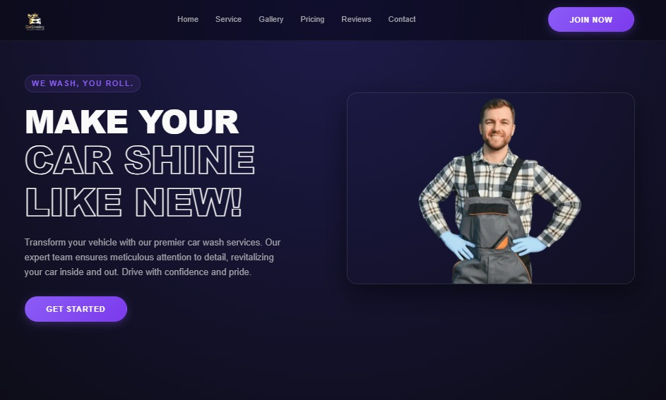
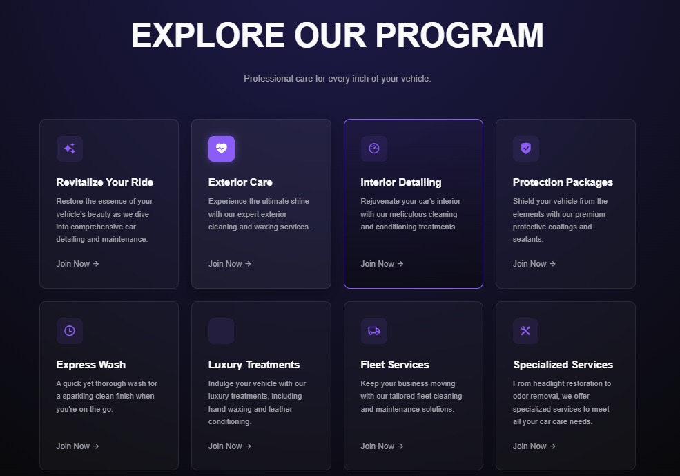
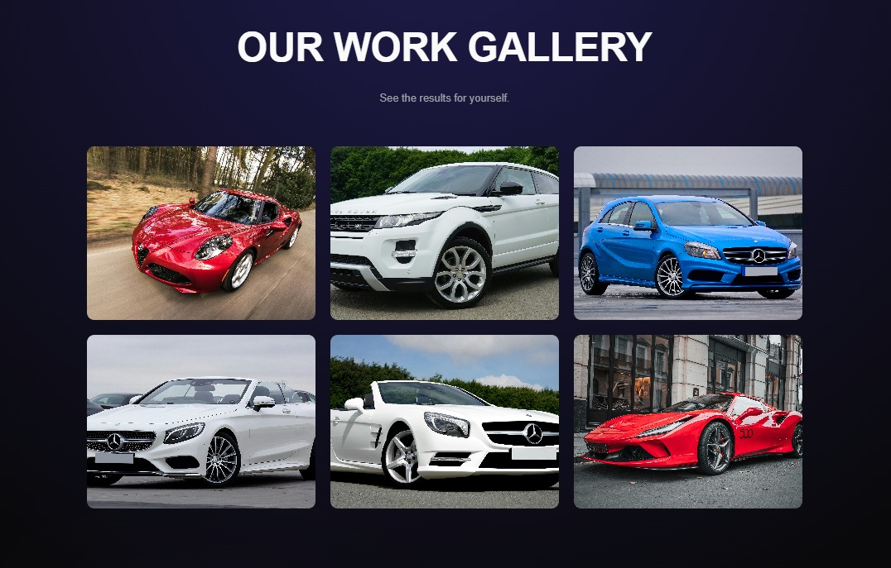
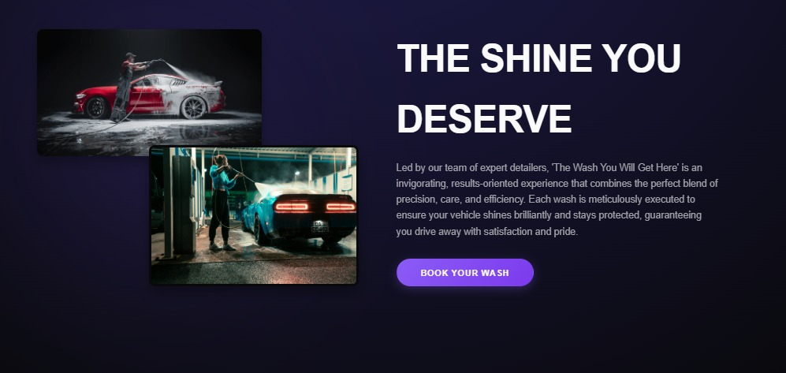
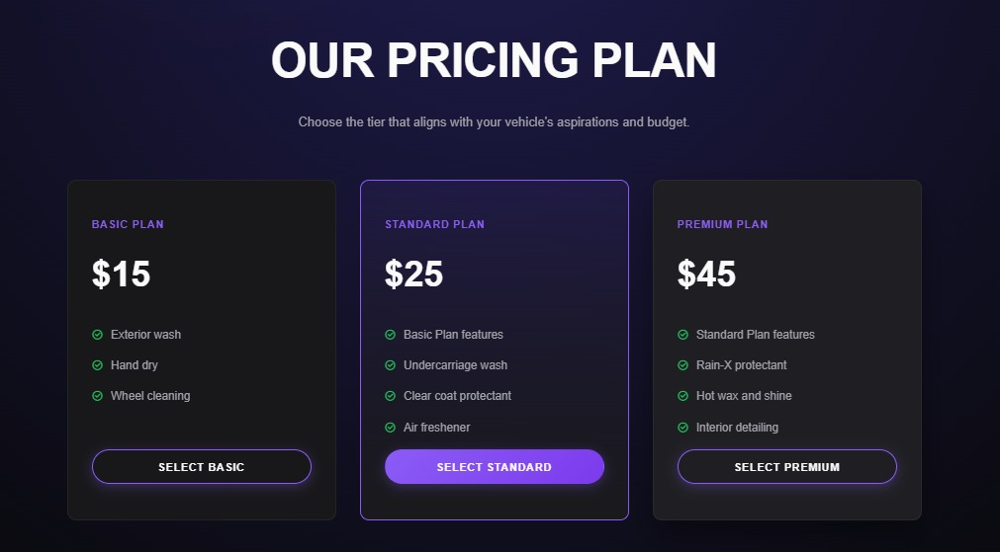

# ✅ **TASK 1 : RESPONSIVE LANDING PAGE**

### **PAGE NAME : CarScrubz**

### **WEBSITE:** 

### **THEME : Car Washing Website**

---

## 📄 **DESCRIPTION**

* Developed a **fully responsive landing page** that seamlessly adapts to various screen sizes and devices.
* Implemented a **modern and interactive navigation menu** with dynamic color changes on scroll and hover.
* Ensured that the navigation bar remains  **fixed at the top** , improving accessibility and user experience.
* Used **HTML** to structure the layout, **CSS** for styling and responsive design, and **JavaScript** to add interactivity.
* Applied functionality to change the **background and font colors** of the navigation menu based on scroll behavior.
* Designed and implemented sections such as  **Hero, Services, Gallery, Pricing, Reviews, FAQ, and Booking Form** .
* Integrated  **AOS animations** , a  **preloader** ,  **stats counter** ,  **lightbox gallery** , and  **scroll-to-top button** .
* Demonstrated frontend development skills through clean UI, responsive layout, and smooth user interactions.
* Improved overall  **aesthetics** , performance, and usability of the website through structured design techniques.
* Followed **best practices** in layout design, accessibility, responsiveness, and user-centric design.

---

## 🧑‍💻 **PROGRAMMING LANGUAGES & TOOLS**

* **HTML5**
* **CSS3**
* **JavaScript (ES6)**
* **Google Fonts**
* **Remix Icons**
* **AOS Animation Library**
* **Netlify Deployment**

---

## 🖼️ **SCREENSHOT OF WEBSITE**

